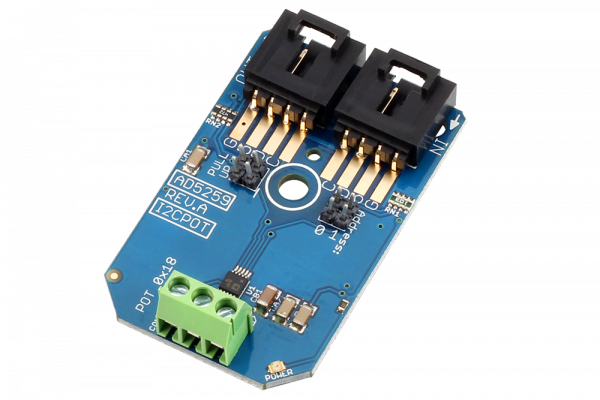

[](https://store.ncd.io/product/analog-devices-ad5259-digital-100k-potentiometer-2-channel-256-position-i2c-mini-module/).

# AD5259

The AD5259 from Analog Devices offers an ideal solution for most digital potentiometer applications. Learn how to use the AD5259 using our I2C Mini Module and take control of two on-board I2C controlled potentiometers with 256 taps. Choose between 5K, 10K, 50K, or 100K versions during ordering.  The AD5259 supports wiper read-back, allowing you to easily read the current wiper settings.
This Device is available from www.ncd.io

[SKU: AD5259]

(https://store.ncd.io/product/analog-devices-ad5259-digital-100k-potentiometer-2-channel-256-position-i2c-mini-module/)
This Sample code can be used with Raspberry Pi.

Hardware needed to interface AD5259 2Channel Potentiometer With Raspberry Pi :

1. <a href="https://store.ncd.io/product/analog-devices-ad5259-digital-100k-potentiometer-2-channel-256-position-i2c-mini-module/">AD5259 2Channel Potentiometer</a>

2.  <a href="https://store.ncd.io/product/i2c-shield-for-raspberry-pi-3-pi2-with-outward-facing-i2c-port-terminates-over-hdmi-port/">Raspberry Pi I2C Shield</a>

3. <a href="https://store.ncd.io/product/i%C2%B2c-cable/">I2C Cable</a>

## Python

Download and install smbus library on Raspberry pi. Steps to install smbus are provided at:

https://pypi.python.org/pypi/smbus-cffi/0.5.1

Download (or git pull) the code in pi. Run the program.

```cpp
$> python AD5259.py
```
The lib is a sample library, you will need to calibrate the sensor according to your application requirement.
